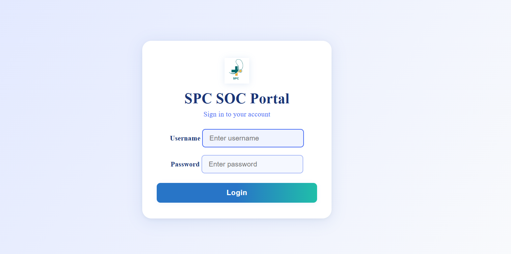
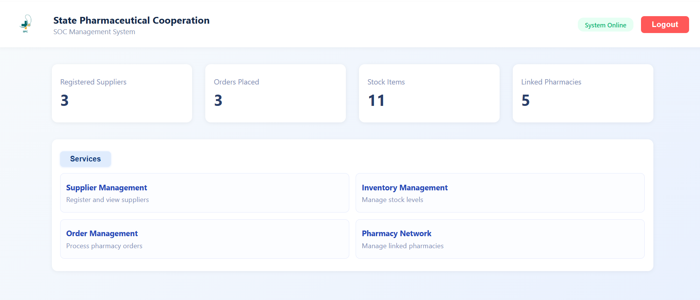
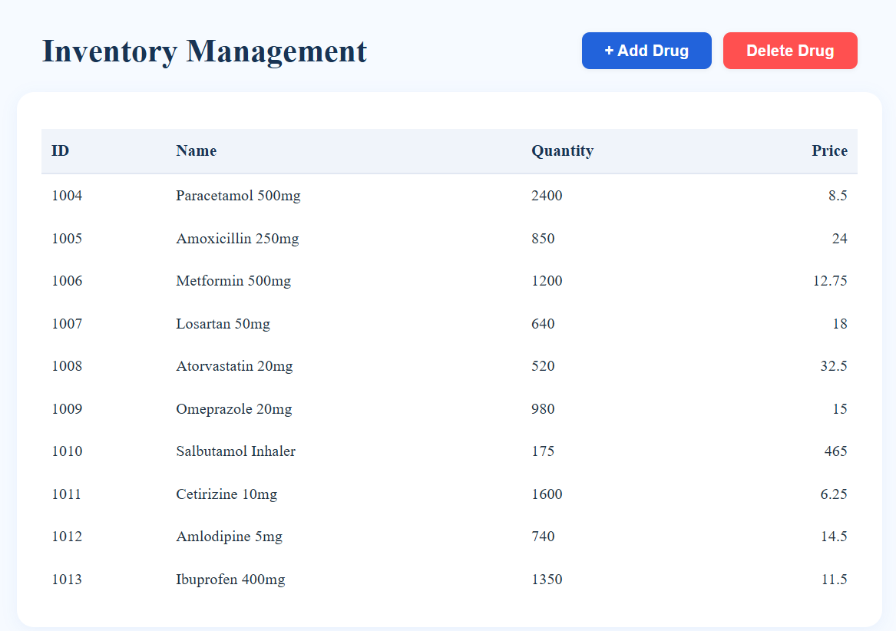
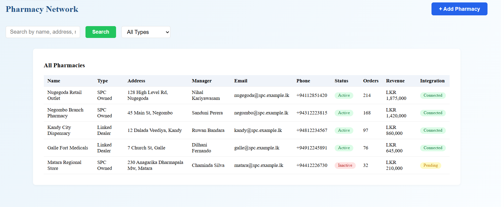

# SPC Pharmacy Network - Pharmacy Management System

A full-stack pharmacy management system for handling drugs, stock, orders, pharmacies and suppliers.
Built with a **React (Vite)** frontend and an **ASP.NET Core 8** REST API backed by **SQL Server** via **Entity Framework Core**.

> Academic project. Branding and logo are placeholders and are not affiliated with or endorsed by any real organisation.

---

## 📸 Screenshots

| Login | Admin Dashboard |
|---|---|
|  |  |

| Inventory Management | Pharmacy Network |
|---|---|
|  |  |

---

## 🛠️ Tech stack

| Layer | Tech |
|---|---|
| **Frontend** | React 19 · Vite 7 · React Router 7 · plain CSS per page |
| **Backend** | C# · ASP.NET Core 8 Web API |
| **Data** | Entity Framework Core 8 (code-first migrations) · SQL Server |
| **Auth** | JWT bearer authentication · BCrypt password hashing |

---

## ✨ Features

**Admin**
- Dashboard with live counts for suppliers, orders, stock items and linked pharmacies
- Inventory management - register drugs, view computed stock levels, retire or delete drugs
- Order management - review pharmacy orders and approve or reject them
- Pharmacy network - register pharmacies, update details, mark integration status
- Supplier management - register suppliers and view the registered list

**Pharmacy user**
- Place orders against registered pharmacies with server-side stock validation
- View own order history with current status
- Search the drug catalogue

---

## 🔐 Security

- **Passwords** are hashed with BCrypt. Nothing is stored in plain text.
- **Authentication** issues a signed JWT carrying the username and role as claims, valid for two hours.
- **Authorization** is enforced server-side: every controller except `AuthController` requires a valid bearer token and the frontend attaches it to each request through a shared API helper.
- **Order visibility is scoped by role** - administrators see all orders, pharmacy users see only their own. The username is taken from the JWT claim, never from the request body, so a user cannot place or read orders as someone else.
- **Status changes are admin-only**, checked against the role claim rather than the calling route.

---

## 📦 Stock as a movement ledger

Stock is not a mutable column on the drug record. Every change writes a signed `StockMovement` row and the current level is the sum of those movements.

| Reason | Sign | Written when |
|---|---|---|
| `OpeningBalance` | + | A drug is registered with an opening stock figure |
| `Receipt` | + | Stock is received against an existing drug |
| `OrderPlaced` | − | A pharmacy places an order |
| `OrderRejected` | + | An administrator rejects a pending order, returning the stock |
| `Adjustment` | ± | A manual correction |

This gives a full audit trail of how a stock level was reached and makes rejection non-destructive - the quantity returns to the ledger rather than being silently lost.

---

## 🧩 Data integrity

- **Orders reference pharmacies by foreign key.** `Order.PharmacyId` points at a registered pharmacy; the previous free-text `PharmacyName` allowed orders against pharmacies that did not exist.
- **Drug names are unique**, enforced by a filtered unique index at the database level rather than an application check.
- **Drugs with order history are retired, not deleted.** `DELETE /api/drugs/{id}` sets `IsActive = false` when any order references the drug, so historical orders keep a resolvable drug name. Drugs with no order history are removed outright along with their movements.
- **Stock cannot go negative.** Orders and adjustments are validated against the computed level before anything is persisted.
- **Decimal precision** is declared explicitly on `Drug.Price` and `Pharmacy.Revenue` to prevent silent truncation.

---

## 📡 API endpoints

22 endpoints across five controllers. All routes except `/api/auth/login` require a valid bearer token.

### Auth - `api/auth`
| Method | Route | Description |
|---|---|---|
| POST | `/api/auth/login` | Verifies credentials against the BCrypt hash, returns a signed JWT with username and role |

### Drugs - `api/drugs`
| Method | Route | Description |
|---|---|---|
| GET | `/api/drugs` | List active drugs with stock computed from the movement ledger (`?includeInactive=true` for retired ones) |
| GET | `/api/drugs/{id}` | Get a drug with its current stock level |
| GET | `/api/drugs/{id}/movements` | Full stock movement history for a drug, newest first |
| POST | `/api/drugs` | Register a new drug; rejects duplicate names with `409`, writes an opening balance if supplied |
| POST | `/api/drugs/{id}/receive` | Record a stock receipt or adjustment; refuses to take stock below zero |
| PUT | `/api/drugs/{id}` | Update name and price; rejects a name already in use |
| DELETE | `/api/drugs/{id}` | Delete if unreferenced, otherwise retire the drug and report which happened |

### Orders - `api/orders`
| Method | Route | Description |
|---|---|---|
| GET | `/api/orders` | Administrators get all orders, pharmacy users get their own; resolves pharmacy and drug names |
| POST | `/api/orders` | Validates the pharmacy and the available stock, then persists the order and its negative movement |
| PATCH | `/api/orders/{id}/status` | Admin only - set `Approved` or `Rejected`; rejection returns the stock to the ledger |

### Pharmacies - `api/pharmacies`
| Method | Route | Description |
|---|---|---|
| GET | `/api/pharmacies` | List all pharmacies |
| GET | `/api/pharmacies/{id}` | Get a pharmacy by id |
| POST | `/api/pharmacies` | Register a pharmacy |
| PUT | `/api/pharmacies/{id}` | Update all fields |
| DELETE | `/api/pharmacies/{id}` | Delete a pharmacy |
| PATCH | `/api/pharmacies/{id}/connect` | Set integration status to `Connected` |

### Suppliers - `api/suppliers`
| Method | Route | Description |
|---|---|---|
| GET | `/api/suppliers` | List all suppliers |
| GET | `/api/suppliers/{id}` | Get a supplier by id |
| POST | `/api/suppliers` | Register a supplier |
| PUT | `/api/suppliers/{id}` | Update supplier details |
| DELETE | `/api/suppliers/{id}` | Delete a supplier |

Swagger UI is available at `/swagger` while the API is running.

---

## 🗂️ Data model

| Entity | Fields |
|---|---|
| **Drug** | `Id`, `Name` (unique), `Price`, `IsActive` |
| **StockMovement** | `Id`, `DrugId`, `Drug`, `Quantity` (signed), `Reason`, `Timestamp`, `Username`, `OrderId` |
| **Order** | `Id`, `DrugId`, `Drug`, `PharmacyId`, `Pharmacy`, `Quantity`, `OrderDate`, `Status`, `Username` |
| **Pharmacy** | `Id`, `Name`, `Type`, `Address`, `Phone`, `Email`, `Manager`, `Status`, `MonthlyOrders`, `Revenue`, `IntegrationStatus` |
| **Supplier** | `Id`, `Name`, `Address`, `Email`, `Phone`, `ContactPerson` |
| **User** | `Id`, `Username`, `Password` (BCrypt hash), `Role` |

`Drug` carries no quantity column - stock is derived from `StockMovement`.

Ten EF Core migrations are committed under `pharmacyapp.server/Migrations/` and applied automatically on startup.

---

## 🚀 Getting started

**Prerequisites:** .NET 8 SDK · Node.js 18+ · SQL Server (Express or LocalDB)

```bash
git clone https://github.com/nisithSaranga/SPC-Pharmacy-Network.git
cd SPC-Pharmacy-Network
```

### 1. Backend

```bash
cd pharmacyapp.server
```

Create `appsettings.Development.json` with your local connection string and a JWT signing key. This file is not committed.

```json
{
  "ConnectionStrings": {
    "DefaultConnection": "Server=localhost\\SQLEXPRESS;Database=PharmacyDB;Trusted_Connection=True;TrustServerCertificate=True;"
  },
  "Jwt": {
    "Key": "a long random secret, at least 32 characters",
    "Issuer": "PharmacyApp"
  }
}
```

For LocalDB, use `Server=(localdb)\\MSSQLLocalDB;` instead.

Trust the ASP.NET Core development certificate once, then run the API:

```bash
dotnet dev-certs https --trust
dotnet run
```

Migrations are applied on startup, so no separate `dotnet ef database update` step is needed. The API runs at `https://localhost:7216` with Swagger UI at `/swagger`.

### 2. Frontend

```bash
cd ../pharmacyapp.client
npm install
npm run dev
```

The client runs at `https://localhost:5173` and expects the API at `https://localhost:7216`.

> The Vite dev server is configured for HTTPS and looks for `localhost.pem` and `localhost-key.pem` in the client folder. These are not committed - generate your own with [mkcert](https://github.com/FiloSottile/mkcert): `mkcert localhost`.

### Demo accounts

Two accounts are seeded on first run if the `Users` table is empty. Passwords are hashed with BCrypt before insertion.

| Username | Password | Role |
|---|---|---|
| `admin` | `admin123` | admin |
| `nisith` | `nisith123` | user |

These are local development credentials only.

---

## 📁 Project structure

```
SPC-Pharmacy-Network/
├── pharmacyapp.client/        React + Vite frontend
│   └── src/
│       ├── api.js             Shared fetch helper, attaches the bearer token
│       └── pages/             Login, Dashboard, UserDashboard, Inventory,
│                              OrderManagement, SupplierManagement, PharmacyNetwork
└── pharmacyapp.server/        ASP.NET Core Web API
    ├── Controllers/           Auth, Drugs, Orders, Pharmacies, Suppliers
    ├── Models/                Drug, StockMovement, Order, Pharmacy, Supplier, User
    ├── Data/                  PharmacyContext
    └── Migrations/
```

---

## ⚠️ Known limitations

- A pharmacy user is not bound to a single pharmacy - the order form lets them select any registered pharmacy rather than only their own.
- Stock is decremented when an order is placed rather than when it is approved, so pending orders hold stock until they are resolved.
- Swagger is enabled in all environments for convenience; it would normally be restricted outside development.

---

Built by **Nisith Saranga**
